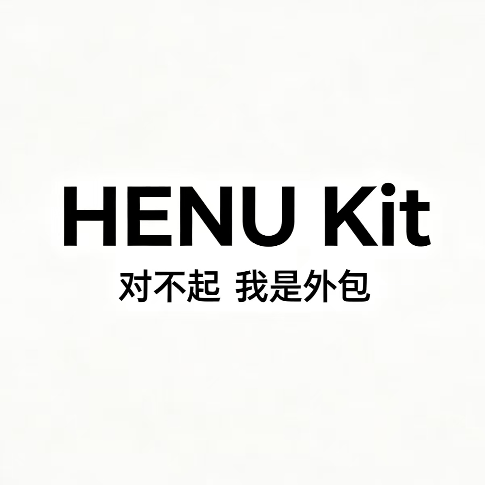
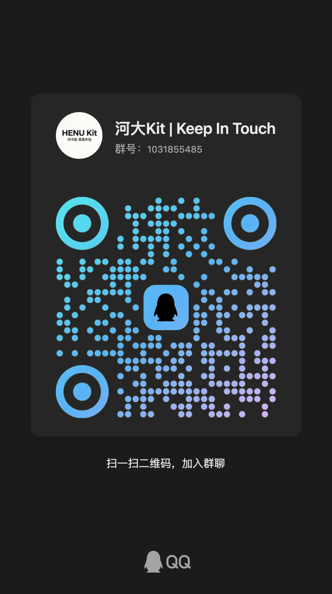

# HENU-Kit

<p align="center">
  
</p>

<p align="center">
  <strong>HENU-Kit | Keep In Touch</strong>
</p>

<p align="center">
  河南大学学生工具合集：校园服务、校园网登录、图书馆预约、期末复习与刷题工具。
</p>

<p align="center">
  <a href="https://github.com/jry21223/HENU_Assistant">HENU Assistant</a>
  ·
  <a href="https://github.com/jry21223/HENU-Final-Review">HENU Final Review</a>
  ·
  <a href="https://github.com/jry21223/HENU-Autologin">HENU Autologin</a>
  ·
  <a href="https://github.com/jry21223/Henu_library_auto_seat_book">Library Seat Book</a>
</p>

---

## 项目简介

**HENU-Kit** 是一个面向河南大学学生的校园工具合集。

这个仓库作为 HENU 相关项目的统一入口，用于集中展示项目索引、使用说明、开发路线图、交流群和相关文档。各个工具仍然保留在独立仓库中维护，避免强行合并代码导致结构混乱。

> 本项目为学生自维护项目，非河南大学官方项目。

---

## 项目列表

| 项目 | 仓库 | 说明 | 状态 |
|---|---|---|---|
| HENU Assistant | [`jry21223/HENU_Assistant`](https://github.com/jry21223/HENU_Assistant) | 校园服务助手，面向课表、空教室、图书馆、请假、选课等校园服务场景 | 核心项目 |
| HENU Final Review | [`jry21223/HENU-Final-Review`](https://github.com/jry21223/HENU-Final-Review) | 期末复习、刷题、模拟卷、答案解析与复习资料整理 | 学习工具 |
| HENU-Autologin | [`jry21223/HENU-Autologin`](https://github.com/jry21223/HENU-Autologin) | 河南大学校园网自动登录工具 | 实用工具 |
| HENU Library Auto Seat Book | [`jry21223/Henu_library_auto_seat_book`](https://github.com/jry21223/Henu_library_auto_seat_book) | 图书馆座位预约自动化工具 | 实用工具 |

---

## 为什么做 HENU-Kit

因为不想在各种app中来回跳转。。不想忍受烦人的广告。

HENU-Kit 的目标不是做一个“大而全”的官方系统，而是把这些真实需求沉淀成一组可维护、可复用、可迭代的学生工具。

---

## 使用建议

不同工具的安装、配置和使用方式，请进入对应仓库查看。

如果你只是想了解整个项目体系，可以先从这里开始：

1. 查看上方项目列表
2. 选择自己需要的工具
3. 阅读对应仓库的 README
4. 按照说明进行配置和使用

---

## 交流群

QQ 群：**1031855485**

<p align="center">
  
</p>

<p align="center">
  扫码加入 HENU-Kit 交流群
</p>

---

## Roadmap

### 短期

- [ ] 统一所有 HENU 相关项目的 README 格式
- [ ] 为每个项目补充截图、安装说明和使用说明
- [ ] 添加项目状态、维护状态和风险说明
- [ ] 为自动化类项目补充安全与合规提醒
- [x] 统一仓库命名风格，例如 `HENU-Autologin`

### 中期

- [ ] 做一个 HENU-Kit 项目展示页
- [ ] 整理常见问题 FAQ
- [ ] 抽离通用配置模板
- [ ] 整理校园系统相关接口文档
- [ ] 为新同学提供更低门槛的使用教程

### 长期

- [ ] 将 HENU-Kit 做成可扩展的校园工具模板
- [ ] 支持其他学校的适配
- [ ] 增加插件化能力
- [ ] 做统一的 Web 控制台
- [ ] 建立更清晰的社区贡献流程

---

## 命名规范

后续 HENU 相关仓库建议统一使用以下风格：

```txt
HENU-Project-Name
```

示例：

```txt
HENU-Autologin
HENU-Final-Review
HENU-Course-Helper
HENU-Library-Seat-Book
```

---

## 安全与合规说明

部分工具可能涉及校园系统自动化操作。请合理使用，避免以下行为：

- 高频请求校园系统
- 共享或泄露账号密码
- 绕过平台限制
- 干扰学校系统正常运行
- 将敏感配置提交到公开仓库

如果项目需要保存账号、密码、Token 或 Cookie，请优先使用环境变量、本地配置文件或 GitHub Secrets，并确保相关文件已加入 `.gitignore`。

---

## 友情链接

- [HENU-CS/SurvivalHandbook](https://github.com/HENU-CS/SurvivalHandbook)
- [Henu-Kaguya/Henu-Kaguya](https://github.com/Henu-Kaguya/Henu-Kaguya)

---

## 贡献

欢迎提交 Issue 或 Pull Request。

适合贡献的内容包括：

- 修复 bug
- 改进文档
- 补充截图
- 增加使用教程
- 优化配置流程
- 提出新的校园工具需求

---

## License

本项目采用 [MIT License](./LICENSE) 开源协议。

---

## Maintainer

Created and maintained by [`jry21223`](https://github.com/jry21223).
