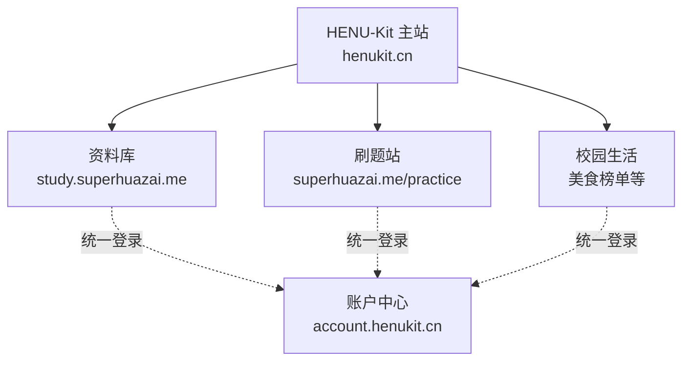

# HENU-Kit 开发计划

## 1. 本轮交付目标

本轮不是重写已有产品，而是完成三个基础结果：

1. `henukit.cn` 成为直观、简洁的统一入口。
2. 主站、资料库和刷题站共享一套学生账户与设计语言。
3. 在统一基础稳定后，再验证美食榜单等新模块。

## 2. 推荐技术结构

| 层级 | 建议 | 说明 |
|---|---|---|
| 门户 | `henukit.cn` | 导航、发现、公告、账户入口，不承载全部业务 |
| 认证 | `account.henukit.cn` | 学生邮箱验证码、统一用户 ID、会话管理 |
| 邮件 | `notify.henukit.cn` + 阿里云 DirectMail | 与现有阿里云 ECS 同账号管理，按量付费 |
| 资料 | 现 `study.superhuazai.me` | 先保持地址，完成统一账户与样式后再评估域名迁移 |
| 刷题 | 现 `superhuazai.me/practice` | 保留唯一刷题引擎和既有前后端 |
| 设计 | 共享 token / 基础组件包 | 统一视觉，不要求业务代码合仓 |

认证服务应向各站提供标准化的登录、注销、会话校验和用户信息接口。各业务库只保存自身业务数据，通过统一 `user_id` 关联，不各自建立第二套账户。

## 2.1 系统归属与结构

主站、资料库、刷题站、校园生活和统一账户不是互不相关的“网站集合”，而是 **同一个 HENU-Kit 产品系统中的不同子产品**。它们可以使用不同代码仓库、技术栈和部署服务，但必须共享产品身份、账户、导航规则、设计规范和基础状态。

系统内统一关系：

| 项目 | 统一要求 |
|---|---|
| 品牌 | 所有子产品统一显示 `HENU-Kit` 产品归属，不再发展彼此竞争的主品牌 |
| 账户 | 使用同一个 `user_id` 和账户中心，不重复注册、重复验证邮箱 |
| 导航 | Logo 返回 `henukit.cn`；全局入口名称、顺序和账户位置保持一致 |
| 视觉 | 共享 Design System、颜色 token、按钮、卡片、状态和页脚 |
| 身份声明 | 所有子产品固定说明“学生自主运营 · 非河南大学官方项目” |
| 数据 | 账户数据集中管理，资料、作答、榜单等业务数据分别归属对应子产品 |

## 2.2 跳转逻辑

### 系统内跳转

- `henukit.cn` 是默认起点和总入口。
- 点击“找资料”进入当前资料库 `study.superhuazai.me`。
- 点击“去刷题”进入当前刷题站 `superhuazai.me/practice`。
- 点击“校园生活”进入 HENU-Kit 内的美食榜单等校园模块。
- 子产品左上角 HENU-Kit Logo 始终返回 `henukit.cn`。
- 系统内子产品默认在当前标签页打开，不使用“外部网站”图标，不制造已经离开 HENU-Kit 的感觉。
- 资料库不内置第二套刷题流程；若出现“去刷题”，应直接跳转到唯一刷题站，并尽量携带课程标识等必要上下文。

### 登录跳转

- 未登录用户触发收藏、下载记录、练习进度等账户功能时，跳转到 `account.henukit.cn`。
- 登录请求携带经过白名单校验的 `return_to`，验证成功后回到用户原来的页面，而不是一律返回首页。
- 只允许跳回 HENU-Kit 自有域名和登记过的现有业务地址，禁止任意外部地址，避免开放重定向漏洞。
- 在任一子产品退出登录后，统一账户会话同时失效；页面回到当前子产品的未登录状态。

### 当前域名与目标域名

第一阶段不因品牌统一而强制迁移现有业务域名，先保证链接、账户和视觉一致：

| 子产品 | 当前可用地址 | 后续品牌别名（评估后启用） |
|---|---|---|
| 主站 | Demo / 待上线 | `henukit.cn` |
| 账户中心 | 待建设 | `account.henukit.cn` |
| 资料库 | `study.superhuazai.me` | `study.henukit.cn` |
| 刷题站 | `superhuazai.me/practice` | `practice.henukit.cn` |
| 通知邮件 | 待建设 | `notify.henukit.cn` |

启用品牌别名后，旧地址应使用永久重定向或保留兼容入口，不能让旧书签和历史链接失效。

### 外部项目跳转

- 生存手册、校园网工具及其他不由当前 HENU-Kit 产品统一维护的项目，标记为“外部项目”。
- 外部项目可以新标签页打开，并显示外部链接图标、维护者和风险说明。
- “是否同一系统”依据账户、导航、设计和维护协议判断，不依据是否收录在 GitHub 项目列表判断。

## 2.3 资料库首页轻量改版

本次只调整资料库首页定位、导航和动效，不重写资料存储、课程页面、下载流程与后端。目标是保留原页面有辨识度的“打开资料册”，同时消除卡顿和与 HENU-Kit 设计系统的割裂。

### 首页信息结构

首页主要任务收敛为：

1. 搜索资料
2. 浏览课程资料
3. 查看我的下载
4. 提交资料或纠错

具体调整：

- 首屏标题、搜索框和“浏览课程资料”作为主要内容。
- “刷题 AI”不再作为资料库独立能力；全局“去刷题”直接跳转唯一刷题站。
- 首页移除“资料旁边就是练习”“错题本”“薄弱点统计”等刷题功能介绍。
- 积分、会员、课程包、群机器人等非核心内容不占据首页一级区块；确需保留时进入独立说明页。
- Wiki、博客和共创内容只有在服务资料整理、说明和勘误时保留，避免发展为泛社区信息流。
- 全局 HENU-Kit Logo 返回 `henukit.cn`，账户入口使用统一账户状态。

### 资料册动效规范

保留书本/资料册视觉隐喻，不原样保留现有重型 Anime.js 滚动场景：

- 首次进入时只播放一次 `600–900ms` 的封面轻启、整体浮入或淡入动画。
- 同时参与动画的核心层控制在 `3–6` 个，只使用 `transform` 和 `opacity`。
- 删除长距离 sticky 滚动绑定、连续翻页、多层视差和随滚动持续计算的位置动画。
- 标题、搜索框和主要按钮从首帧即可查看和操作，不等待动画完成。
- 桌面端可以保留轻微悬停反馈；移动端默认使用静态资料册或一次简单淡入。
- `prefers-reduced-motion: reduce` 下完全关闭非必要动画。
- 简化后若 Anime.js 只剩一次基础时间线，优先改用 CSS；如果继续使用 Anime.js，必须按需加载并只驱动首屏必要节点。
- 原完整版动画可作为设计存档、宣传录屏或非默认展示页保留，不进入用户查资料的关键路径。

### 视觉调整

- 资料册封面以 `Kit 墨绿 #0C6B45` 为主色。
- 背景使用纸白，麦金仅用于书签、页码或小面积高光。
- 共享 HENU-Kit 的按钮、输入框、圆角、状态反馈和页脚声明。
- 不使用另一套独立品牌色或夸张阴影制造“子站品牌”。

### 验收标准

- 360px 宽度下无需等待动画即可搜索和进入课程资料。
- 低性能设备或减少动态模式下，页面不因动画缺失而出现空白、遮挡或无法操作。
- 快速滚动不会触发持续翻页、明显掉帧或阻塞输入。
- 首页不再呈现第二套刷题产品，所有刷题入口指向 `superhuazai.me/practice`。
- 用户能从资料库识别自己仍在 HENU-Kit 系统内，并能一键返回主站。
- 改动前后完成移动端真机测试，并记录首屏加载、交互延迟和动画帧稳定性。

## 3. 工作流顺序

### 3.1 规则先行

- Design System 是页面设计和验收依据。
- Roadmap 是范围和优先级依据。
- 影响品牌、账户、导航、隐私或模块边界的修改必须先更新文档再开发。

### 3.2 任务进入开发前

Issue 必须写明：

- 用户问题与目标人群
- 本次范围与明确不做的内容
- 验收条件
- 涉及的页面/API/数据
- 安全、隐私和回滚影响
- 负责人和验收人

### 3.3 开发与评审

- 一个 PR 解决一个可说明的问题。
- 共享组件不得直接在业务页复制后长期分叉。
- API 和前端错误必须有可读 `message` 与一致状态语义。
- PR 至少附移动端截图或录屏、测试结果和回滚说明。
- 核心账户功能至少由一名非作者成员评审。

## 4. 统一账户最小方案

### 用户流程

1. 用户输入学生邮箱。
2. 服务端校验允许的邮箱后缀和频率限制。
3. 生成随机验证码，只保存哈希与过期时间。
4. 通过阿里云 DirectMail 发送验证码。
5. 验证成功后创建/读取统一用户，并签发会话。
6. 各业务站通过统一账户服务识别 `user_id`。

### 安全基线

- 验证码 5–10 分钟过期、单次使用。
- 至少等待 60 秒才能重发。
- 对邮箱、IP 和设备设置小时/日级限制。
- 日志不记录完整邮箱、原始验证码、Token 和 Cookie。
- 会话 Cookie 使用 `Secure`、`HttpOnly` 和合理的 `SameSite` 策略。
- 跨子域会话方案必须经过威胁评审，不默认把高权限 Cookie 暴露给所有子域。
- 提供全端退出、会话过期和账户数据删除/申请流程。

### 邮件成本与验证

阿里云 DirectMail 当前免费额度为累计 2,000 封、每天最多免费 200 封；按量付费为 2 元/1,000 封（以[阿里云官方计费文档](https://help.aliyun.com/zh/direct-mail/billing-methods)为准）。MVP 不购买资源包，先对不同年级学生邮箱进行送达、延迟和垃圾箱测试。

## 5. 数据边界

| 数据 | 归属 |
|---|---|
| 用户 ID、学生邮箱验证状态、会话 | 统一账户服务 |
| 资料元数据、文件和下载信息 | 资料库 |
| 题目、作答、错题和练习进度 | 刷题站 |
| 餐厅、榜单、评价与纠错 | 校园生活模块 |
| 工具入口、状态、公告 | HENU-Kit 主站 |

跨服务只传递完成任务所需的最少数据。邮箱不作为业务表之间的长期关联键，统一使用不可猜测的 `user_id`。

## 6. 分工建议

以下按职责分工，不要求一人只承担一种角色；团队较小时可以合并角色，但 Owner 和验收人不能是同一个人。

| 工作流 | Owner 职责 | 第一阶段交付 | 验收角色 |
|---|---|---|---|
| 产品与项目 | 控范围、排优先级、主持周会、维护 roadmap | 产品地图、Issue 拆分、里程碑看板 | 全体核心成员 |
| 设计与前端 | 维护设计系统、主站、共享组件与移动端体验 | 主站 MVP、token、导航、状态组件 | 产品 Owner + 非作者前端 |
| 后端与账户 | 统一用户、验证码、会话、限流和接口 | `account` 服务、邮件接入、审计与回滚 | 安全/运维 Owner |
| 资料与内容 | 维护资料库边界、元数据、纠错与内容规范 | 资料库统一外壳与数据盘点 | 产品 Owner |
| 刷题产品 | 保持唯一题库能力、接入统一账户与组件 | 登录接入、进度迁移、练习体验回归 | 非作者业务成员 |
| 运维与安全 | 域名、DNS、ECS、密钥、监控、备份和发布 | 域名方案、环境隔离、告警与备份验证 | 后端 Owner |
| 社区与测试 | 收集反馈、组织学生测试、维护 FAQ | 10–20 人首轮测试、问题分级和发布说明 | 产品 Owner |

会议上为每行填写真实姓名，并为 Phase 0–2 各确定一名最终负责人。

## 7. 团队节奏

- 每周一次 30 分钟里程碑会：只讨论进度、风险和需要决策的事项。
- 每个工作日异步更新：完成、下一步、阻塞三项。
- 功能争议先回到模块边界和用户任务，不靠增加更多入口折中。
- 每两周一个可演示增量；没有可演示结果的任务需拆小。
- 紧急线上问题先恢复服务，再补 Issue、复盘和防复发措施。

## 8. 当前风险

| 风险 | 应对 |
|---|---|
| 各站视觉统一但账户仍割裂 | 统一账户作为 Phase 2 核心，不先做表面换肤 |
| 验证码进入垃圾箱或延迟 | 在真实腾讯企业邮箱上做小规模送达测试，保留邮件供应商适配层 |
| 主站逐渐复制全部功能 | 用模块边界和 PR 验收阻止重复建设 |
| 学生自主项目被误认官方 | 固定非官方声明，不使用校徽和“官方”措辞 |
| 团队同时开太多方向 | 每阶段最多一个主目标，美食榜单排在统一基础之后 |
| 旧用户数据无法关联 | 设计迁移表和一次性绑定流程，不以邮箱直接覆盖数据 |

## 9. 本次会议必须做出的决定

1. 是否确认本计划中的产品边界和阶段顺序。
2. `henukit.cn`、`account.henukit.cn`、`notify.henukit.cn` 的负责人。
3. Phase 0、主站 MVP、统一账户三条工作流的 Owner 与验收人。
4. 统一账户先接哪个现有站点，以及旧用户数据迁移方式。
5. 正式 Logo 的负责人、方案数量和评审日期。
6. 第一批 10–20 名学生测试者如何招募。

会议不需要决定远期插件化、其他学校适配或复杂社区功能。
