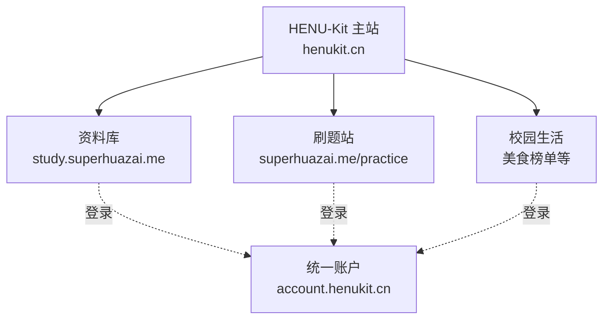

# HENU-Kit 团队会议通报稿

> 建议时长：30–40 分钟  
> 会议结果：确认边界、顺序、负责人和第一阶段交付。

## 一句话结论

HENU-Kit 接下来不再只是 GitHub 项目列表，也不做大而全的新平台；它会成为统一入口和产品外壳，复用现有资料库与刷题站，通过统一设计和学生邮箱账户把它们连接起来。

这里的“连接”不是简单放几个友情链接：**主站、资料库、刷题站、校园生活和账户中心共同从属于 HENU-Kit 系统**。它们可以独立部署，但对学生来说应当是一套产品。

## 当前系统结构与跳转（5 分钟）

- `henukit.cn` 是系统首页和默认返回点。
- “找资料”跳到资料库；“去刷题”跳到唯一刷题站；“校园生活”进入美食榜单等模块。
- 系统内跳转默认在当前标签页打开，各子产品 Logo 都返回 HENU-Kit 主站。
- 未登录用户触发下载记录、收藏或练习进度时，进入统一账户中心；登录后回到原页面。
- 资料库不重新实现刷题。“去刷题”直接跳转刷题站，并在可能时携带课程上下文。
- 现有域名暂时保留；后续可增加 `study.henukit.cn` 和 `practice.henukit.cn` 品牌别名，不为统一域名贸然重写业务。
- 只有明确标注为“外部项目”的链接才新标签页打开；GitHub 收录不等于从属于统一产品系统。

团队需要用同一套 Logo/产品归属、学生账户、全局导航、Design System 和非官方声明，让用户感知到它们属于同一个 HENU-Kit。

## 资料库本轮小改（5 分钟）

资料库保留“打开资料册”的创意，但不保留当前重型的 Anime.js 长滚动动画。

- 首屏改为一次 `600–900ms` 的轻量资料册浮入/轻启，核心动画层控制在 `3–6` 个。
- 只使用 `transform` 和 `opacity`，取消 sticky 长滚动、连续翻页和多层视差。
- 搜索框和主要按钮立即可操作；手机端使用静态图或简单淡入；减少动态模式完全关闭动画。
- 资料册改用 Kit 墨绿、纸白和少量麦金，接入统一按钮、输入框、页脚和账户状态。
- 首页聚焦“搜索资料、浏览课程、我的下载、资料纠错/共建”。
- 首页移除独立“刷题 AI”、错题本、薄弱点统计等介绍；“去刷题”直接跳转唯一刷题站。
- 积分、会员、课程包、LangBot 等内容退出首页一级区块，避免资料库继续膨胀成综合平台。
- 原完整版动画作为设计存档或宣传素材保留，不进入查资料的关键路径。

本轮验收重点不是“动画还够不够酷”，而是：记忆点是否保留、手机是否流畅、搜索是否立即可用、资料库边界是否清楚。

## 1. 当前情况（5 分钟）

- HENU-Kit 已有初版 Demo，但还缺少稳定的统一规范和产品边界。
- 资料库位于 `study.superhuazai.me`，继续只承担资料管理。
- 刷题能力位于 `superhuazai.me/practice`，继续作为唯一刷题引擎。
- 计划购买/使用 `henukit.cn` 作为主站域名。
- 河南大学学生拥有学生邮箱，邮箱服务由腾讯企业邮箱承载，可以用于验证码登录。
- 服务器在阿里云 ECS，验证码邮件建议先用阿里云 DirectMail；邮件服务与 ECS 独立，但同账号管理更方便。

## 2. 已经确定的原则（5 分钟）

- 项目由学生自主运营，非河南大学官方项目，不代表学校官方立场。
- 主品牌色为 `Kit 墨绿 / Kit Ink Green #0C6B45`，不称“河大绿”，不宣称官方色。
- 不复制或改造校徽；现有“对不起 我是外包”Logo 作为社区趣味版本保留，不作为正式主 Logo。
- 资料库不新增刷题；刷题站不复制资料库。
- 各产品可以独立部署，但共享账户、导航、设计 token 和基础状态。
- 功能优先直观、简洁，一个页面一个主要任务。

## 3. 新 Roadmap（8 分钟）

1. **规则与盘点**：发布设计基线、确认域名、技术栈、Owner。
2. **主站 MVP**：让学生从 `henukit.cn` 快速找到资料和刷题入口。
3. **统一账户**：建设 `account.henukit.cn`，使用学生邮箱验证码登录。
4. **统一体验**：逐站接入账户、页头、组件和非官方声明。
5. **校园生活 MVP**：基础稳定后再验证美食榜单，先做轻量浏览和纠错。

旧 roadmap 中 README、截图、FAQ、维护状态、贡献流程继续执行；其他学校适配、插件化和大一统控制台暂缓。

## 4. 为什么这样排（3 分钟）

- 先统一规则，避免三套站点继续长出三套设计。
- 先复用现有功能，避免重复开发资料和刷题。
- 先打通账户和产品外壳，再增加美食等新模块。
- 邮件费用不是主要成本：阿里云 DirectMail 按量约 2 元/1,000 封，先用免费额度和按量付费即可。

## 5. 现场分工（10 分钟）

请现场填写：

| 工作流 | Owner | 验收人 | 首个交付 | 截止时间 |
|---|---|---|---|---|
| 产品与 roadmap |  |  | 拆分 Phase 0–2 Issues |  |
| 设计系统与主站 |  |  | 主站移动端关键页面 |  |
| 统一账户与邮件 |  |  | 邮箱验证码技术验证 |  |
| 资料库接入 |  |  | 边界盘点与统一外壳方案 |  |
| 刷题站接入 |  |  | 登录与进度数据盘点 |  |
| 域名、部署与安全 |  |  | DNS、环境和密钥方案 |  |
| 学生测试与反馈 |  |  | 10–20 人测试名单 |  |

规则：每项只有一个最终 Owner；Owner 与验收人不能是同一个人；一个人同期最多负责一个主里程碑。

## 6. 需要会议拍板（5 分钟）

- 接受还是修改当前产品边界？
- 谁负责购买/配置 `henukit.cn` 及三个子域名？
- 统一账户首先接入主站、刷题站还是资料库？建议顺序：主站 → 刷题站 → 资料库。
- 老刷题用户如何绑定新的统一账户？
- Logo 由谁出方案、何时评审？
- 第一轮内测何时开始、覆盖哪些年级？

## 7. 会后立即执行

- 24 小时内把会议决策写回 Issue 和 Roadmap。
- 48 小时内完成域名、技术栈和数据盘点。
- 一周内演示主站信息架构与学生邮箱验证码技术验证。
- 任何新增需求先判断归属模块，再决定是否排期。

## 可直接使用的开场白

> 今天我们不讨论把 HENU-Kit 做成多大的平台，而是先统一它是什么、现有产品怎么接进来、谁对哪一块负责。我们已经有资料库和刷题站，因此不会重复造轮子。接下来先把 HENU-Kit 做成一个简洁的统一入口，再用学生邮箱打通账户和体验。设计上保留现在的深绿色，但它是 HENU-Kit 自己的“Kit 墨绿”，不是学校官方色；整个项目也会持续明确标注学生自主运营、非官方。今天会议结束前，我们需要确定产品边界、前三个阶段的 Owner、域名与账户方案，以及第一轮内测安排。
